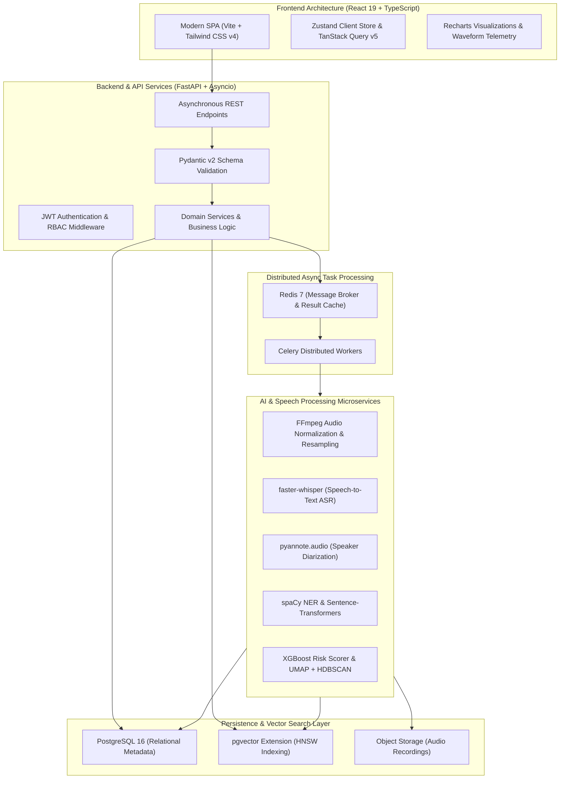

# AI Call Analytics — Full-Stack Enterprise Intelligence Platform

[](https://react.dev/)
[](https://tailwindcss.com/)
[](https://fastapi.tiangolo.com/)
[](https://github.com/pgvector/pgvector)
[](https://redis.io/)
[](https://docs.celeryq.dev/)
[](https://www.docker.com/)

An end-to-end, production-grade **Full-Stack Speech Intelligence Platform** designed to ingest, process, and analyze enterprise customer support calls. The platform integrates a modern **React 19 + TypeScript SPA**, an **asynchronous FastAPI backend**, a **distributed Celery task queue**, and **PostgreSQL with pgvector** for semantic vector search and real-time conversation telemetry.

---

## 💼 Full-Stack Engineering Competencies Demonstrated

| Layer | Core Skills & Methodologies | Technologies |
|---|---|---|
| **Frontend Engineering** | Reactive Component Architecture, Server-State Synchronization, Optimistic UI Updates, Type Safety, Dynamic Telemetry Charts | React 19, TypeScript, Tailwind CSS v4, TanStack Query v5, Zustand v5, Recharts, Vite |
| **Backend & API Design** | Asynchronous Non-Blocking I/O, Layered Clean Architecture, RESTful API Standards, Structured JSON Logging, Authentication & RBAC | Python 3.11, FastAPI, Pydantic v2, SQLAlchemy 2.0 (asyncio), structlog, JWT (python-jose) |
| **Data & Vector Storage** | Relational Modeling, High-Dimensional Vector Embeddings, HNSW Vector Indexing, Migrations, Connection Pooling | PostgreSQL 16, pgvector, Alembic, asyncpg |
| **Distributed Systems** | Asynchronous Task Queuing, Heavy Computation Decoupling, Worker Concurrency, Cache Management | Redis 7, Celery 5.4 |
| **AI/ML Systems Integration** | Speech-to-Text Pipeline, Multi-Speaker Diarization, Sentiment Trajectory Modeling, Unsupervised Clustering, Risk Inference | faster-whisper, pyannote.audio, Sentence-Transformers, UMAP, HDBSCAN, XGBoost, spaCy |
| **DevOps & Architecture** | Multi-Stage Containerization, Service Orchestration, Automated Healthchecks, Environment Isolation | Docker, Docker Compose, Linux Alpine containers |

---

## 🏛️ System Architecture & Data Pipeline



---

## 🔍 Technical Deep-Dive

### 1. Frontend Architecture (React 19 + TypeScript)
- **Component-Driven Design**: Built with Vite and React 19, adopting modular layouts (`layouts/`), reusable components (`components/`), and page views (`pages/`).
- **Server-State Management with TanStack Query v5**: Decouples API fetching from component lifecycle, offering automatic cache invalidation, background refetching, and query deduplication.
- **Client State via Zustand v5**: Minimal-overhead atomic store managing global audio playback position, active call filters, and transcript auto-scroll states without unnecessary re-renders.
- **Data Visualization with Recharts**: Custom interactive charts rendering sentiment progression timelines, speaker talk-time ratios, customer intent distributions, and agent quality scores.
- **Modern Styling System**: Styled using Tailwind CSS v4 for a responsive, dark-mode first, glassmorphic enterprise dashboard.

### 2. Backend & System Design (FastAPI + Asyncio)
- **High-Concurrency Async Core**: Non-blocking request handlers powered by Python 3.11 `asyncio` and `uvicorn`, maximizing I/O performance for high-throughput concurrent workloads.
- **Clean Layered Architecture**:
  - `api/`: REST route controllers and HTTP request/response serialization.
  - `services/`: Encapsulated domain business logic.
  - `models/`: SQLAlchemy 2.0 Declarative ORM models.
  - `schemas/`: Pydantic v2 data transfer objects guaranteeing strict runtime validation.
- **Database Connection Pooling**: Async PostgreSQL driver (`asyncpg`) integrated with SQLAlchemy 2.0 connection pooling to eliminate connection bottlenecks.
- **Enterprise Security**: Stateless JSON Web Token (JWT) authentication with password hashing (Bcrypt/Argon2) and route-level authorization dependencies.
- **Production Observability**: Structured JSON logging powered by `structlog` for correlation IDs and distributed request tracking.

### 3. Distributed Task Queue & Microservices (Celery + Redis)
- **Decoupled Heavy Audio Compute**: Long-running audio decoding, speaker diarization, and LLM inference tasks are dispatched as asynchronous Celery tasks to avoid blocking web workers.
- **Message Broker & In-Memory Caching**: Redis 7 acts as a fast message broker for Celery queues while caching frequently accessed dashboard aggregate statistics.

### 4. Database & Vector Search Engine (PostgreSQL 16 + pgvector)
- **Hybrid Relational & Vector Storage**: Stores traditional structured data (users, organizations, call metadata, transcripts) alongside 768-dimensional dense vector embeddings in a single unified database.
- **HNSW Approximate Nearest Neighbor Search**: Employs `pgvector` with Hierarchical Navigable Small World (HNSW) indexing to achieve millisecond-level semantic similarity queries across millions of call utterances.
- **Zero-Downtime Database Migrations**: Automated schema evolution managed through Alembic migration scripts.

---

## 🛠️ Technology Stack

| Domain | Technology | Purpose |
|---|---|---|
| **Frontend Framework** | React 19, TypeScript, Vite | Single-page application core & type safety |
| **Frontend State & Cache** | TanStack Query v5, Zustand v5 | Server state caching & client UI state |
| **Data Visualization** | Recharts 3.x, Lucide React | Visual metric dashboards & iconography |
| **Styling** | Tailwind CSS v4 | Responsive utility-first design system |
| **Backend Framework** | FastAPI, Pydantic v2, Uvicorn | Asynchronous RESTful API engine |
| **Database & ORM** | PostgreSQL 16, SQLAlchemy 2.0 (async), Alembic | Relational data persistence & migrations |
| **Vector Search** | pgvector (HNSW Indexing) | Semantic embeddings and similarity queries |
| **Task Queue & Cache** | Redis 7, Celery 5.4 | Distributed background task execution |
| **Audio Processing** | FFmpeg, librosa, soundfile | Format conversion, 16kHz resampling, VAD |
| **Speech & NLP AI** | faster-whisper, pyannote.audio, spaCy | ASR transcription, diarization, entity recognition |
| **Machine Learning** | Sentence-Transformers, UMAP, HDBSCAN, XGBoost | Intent classification, clustering, risk scoring |
| **Containerization** | Docker, Docker Compose | Multi-container reproducible environments |

---

## 📂 Repository Directory Layout

```text
AI-Call-Analytics/
├── frontend/                     # React 19 + TypeScript SPA
│   ├── src/
│   │   ├── charts/               # Recharts visualization modules
│   │   ├── components/           # Reusable UI components & design system
│   │   ├── hooks/                # Custom React hooks (useAudioPlayer, useAnalytics)
│   │   ├── layouts/              # Dashboard shell and responsive navigation
│   │   ├── pages/                # Page views (Dashboard, Calls, Details, Settings)
│   │   ├── services/             # Axios/Fetch API client functions
│   │   ├── store/                # Zustand client stores
│   │   ├── types/                # TypeScript interface contracts
│   │   └── utils/                # Formatting, calculations & helpers
│   ├── package.json              # Frontend manifest & scripts
│   └── vite.config.ts            # Vite bundler configuration
│
├── backend/                      # Scalable FastAPI Microservice
│   ├── app/
│   │   ├── api/                  # API endpoints & route versioning (/api/v1)
│   │   ├── core/                 # App configuration, security & structured logging
│   │   ├── database/             # Async session factory & base models
│   │   ├── models/               # SQLAlchemy 2.0 ORM entities
│   │   ├── schemas/              # Pydantic v2 input/output data schemas
│   │   ├── services/             # Business logic & domain services
│   │   ├── utils/                # Cryptography, token handling & helpers
│   │   └── workers/              # Celery task definitions
│   ├── tests/                    # Pytest backend test suite
│   └── requirements.txt          # Python backend dependencies
│
├── ai_service/                   # ML & Speech Intelligence Pipeline
│   ├── audio/                    # Audio normalization, silence trimming (FFmpeg)
│   ├── asr/                      # Speech-to-text inference (faster-whisper)
│   ├── diarization/              # Speaker diarization & turn-taking (pyannote.audio)
│   ├── sentiment/                # Turn-by-turn polarity & emotion scoring
│   ├── intent/                   # Customer intent classification
│   ├── ner/                      # PII redaction & named entity recognition
│   ├── embeddings/               # Semantic vector generation
│   ├── clustering/               # Unsupervised call clustering (UMAP + HDBSCAN)
│   ├── risk/                     # Churn & escalation risk model (XGBoost)
│   └── pipeline/                 # End-to-end composite pipeline orchestrator
│
├── docker/                       # Production & Dev Dockerfiles
│   ├── backend.Dockerfile        # Multi-stage Python FastAPI container
│   ├── frontend.Dockerfile       # Node build & static serve container
│   └── init-pgvector.sql         # DB bootstrap script with vector extension
│
├── data/                         # Audio tiers & training datasets
├── docs/                         # Architecture & API documentation
├── docker-compose.yml            # Multi-service orchestration
└── .env.example                  # Environment configuration template
```

---

## ⚡ Quick Start & Development Setup

### Prerequisites
- **Docker & Docker Compose** (Recommended)
- **Node.js 20+** & **Python 3.11+** (For native development)
- **FFmpeg** (For local audio processing)

---

### Option 1: Docker Compose (All Services)

Launch the full stack (Frontend, Backend, PostgreSQL with `pgvector`, and Redis) with one command:

```bash
# 1. Clone repository
git clone https://github.com/vrajgoti07/AI-Call-Analytics.git
cd AI-Call-Analytics

# 2. Configure environment
cp .env.example .env

# 3. Spin up all containerized services
docker compose up --build -d
```

#### Service Endpoints:
- **Web Application Dashboard**: [http://localhost:5173](http://localhost:5173)
- **FastAPI Interactive Swagger Docs**: [http://localhost:8000/docs](http://localhost:8000/docs)
- **Backend Health Check**: [http://localhost:8000/health](http://localhost:8000/health)

---

### Option 2: Local Native Development

#### 1. Start Infrastructure (PostgreSQL + Redis)
```bash
docker compose up -d postgres redis
```

Verify the `pgvector` extension:
```bash
docker compose exec postgres psql -U postgres -d ai_call_analytics -c "\dx"
```

#### 2. Backend Service Setup
```bash
cd backend

# Create virtual environment
python -m venv venv

# Activate virtual environment
# Windows PowerShell:
.\venv\Scripts\Activate.ps1
# macOS/Linux:
# source venv/bin/activate

# Install dependencies
pip install -r requirements.txt

# Start backend server with hot-reload
uvicorn app.main:app --reload --port 8000
```

#### 3. Frontend Application Setup
```bash
cd ../frontend

# Install dependencies
npm install

# Start Vite dev server
npm run dev
```

---

## 🧪 Testing & Code Quality

```bash
# Run backend test suite
cd backend
pytest -v

# Run frontend static analysis
cd frontend
npm run lint

# Build frontend production bundle
npm run build
```

---

## 📄 License

Developed as an Engineering Project demonstrating modern **Full-Stack Software Architecture**, **Distributed Systems**, and **AI Intelligence Pipelines**.

Distributed under the MIT License.
