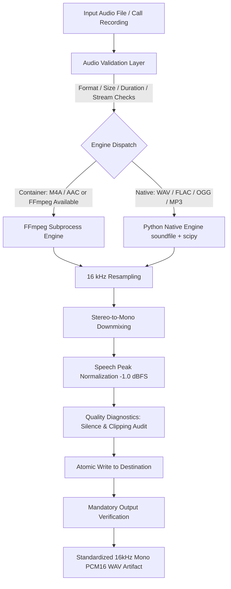

# Audio Preprocessing Pipeline — AI Call Analytics (Phase 2)

This document specifies the architecture, contracts, standards, and operations of the **Audio Preprocessing Pipeline** in AI Call Analytics.

The audio preprocessing module accepts heterogeneous, multi-format call recordings and standardizes them into clean, speech-optimized audio artifacts consumed by downstream **Whisper Speech-to-Text (ASR)** and **Speaker Diarization** engines.

---

## 1. Pipeline Architecture



---

## 2. Standardized Target Specification

Every audio file processed by this pipeline is guaranteed to meet the following specification:

| Parameter | Specification | Purpose / Rationale |
|---|---|---|
| **Container** | `WAV` (RIFF) | Universal, uncompressed, low-latency format for ASR |
| **Codec / Subtype** | `PCM_16` (16-bit linear PCM little-endian) | Standard signed 16-bit depth expected by Whisper & PyAnnote |
| **Sampling Rate** | `16,000 Hz` (16 kHz) | Native acoustic bandwidth required by Whisper without internal resampling |
| **Channels** | `1` (Mono) | Averages multi-channel audio to eliminate spatial bias and reduce memory by 50% |
| **Amplitude Normalization** | Linear peak scaling to `-1.0 dBFS` (peak ~0.891) | Normalizes call loudness across heterogeneous mics while preventing digital clipping |
| **Silence Handling** | Preserved by default (`trim_silence=False`) | Retains conversational cadence, pause durations, turn-taking, and hesitations |

---

## 3. Supported Input Formats

The pipeline supports both containerized compressed and uncompressed speech audio:

| Format / Extension | Native Python Support | FFmpeg Support | Notes |
|---|---|---|---|
| `.wav` | Yes (`soundfile`) | Yes | Standard uncompressed telephony / microphone audio |
| `.mp3` | Yes (`soundfile` via libsndfile) | Yes | Common compressed call recording format |
| `.flac` | Yes (`soundfile`) | Yes | Lossless compressed voice data |
| `.ogg` / `.opus` | Yes (`soundfile`) | Yes | Modern web call recording format |
| `.m4a` / `.aac` | Requires FFmpeg | Yes | iOS / mobile / VoIP recording format; requires FFmpeg binary |

> **Dual-Engine Resilience**: When FFmpeg is installed, it handles all formats seamlessly via secure subprocess execution. When FFmpeg is absent (e.g. minimal dev environments), the pipeline falls back to Python-native processing (`soundfile` + `scipy.signal.resample_poly`) for all native formats, and cleanly reports `FFmpegNotInstalledError` if an M4A/AAC file is provided.

---

## 4. Audio Quality Diagnostics & Telemetry

Before finalizing the processed audio, the pipeline executes comprehensive signal analysis:

* **Peak dBFS**: $20 \log_{10}(\max |x|)$ — measures the loudest peak relative to digital full scale.
* **RMS Power (dBFS)**: $20 \log_{10}(\sqrt{\frac{1}{N}\sum x_i^2})$ — measures continuous conversational speech energy.
* **Silence Ratio**: Percentage of samples below `-40.0 dBFS`. Emits warning if silence exceeds `90.0%`.
* **Clipping Ratio**: Percentage of samples at or exceeding digital ceiling ($\ge 0.999$). Emits warning if clipping exceeds `0.1%`.
* **Low Amplitude Warning**: Emits operational warning if peak level is below `-45.0 dBFS` (indicating faint, muted, or disconnected microphones).

---

## 5. Idempotent Storage & Directory Layout

Processed call artifacts follow a predictable, collision-free storage structure:

```text
data/processed/
├── <call_id_1>/
│   └── audio.wav          # Standardized 16kHz mono PCM16 WAV
├── <call_id_2>/
│   └── audio.wav
└── <filename>_standardized.wav
```

### Idempotency Policy:
* **`reuse_existing` (default)**: If the destination file exists and passes strict 16kHz mono WAV validation, the pipeline reuses the artifact immediately without re-conversion (`status="reused"`).
* **`overwrite`**: Forces re-conversion and atomic replacement.
* **`error`**: Raises `FileExistsError` if the output file is already present.

---

## 6. How to Use the Pipeline

### Python API

```python
from ai_service.audio import AudioPreprocessor, AudioConfig

# Initialize with custom or default configuration
config = AudioConfig(output_dir="data/processed")
preprocessor = AudioPreprocessor(config)

# 1. Preprocess an arbitrary audio file
result = preprocessor.preprocess("data/raw/customer_call.mp3", call_id="call_98765")
print(f"Standardized WAV: {result.output_path}")
print(f"Duration: {result.duration_seconds}s, Sample Rate: {result.sample_rate} Hz")

# 2. Bridge MInDS-14 dataset directly into standardized 16kHz audio
from ai_service.datasets import load_minds14

dataset = load_minds14(subset="en-US", split="train")
sample = dataset[0]

result = preprocessor.preprocess_minds14_example(sample, call_id="minds14_sample_0")
```

### Command Line Interface

```bash
# Preprocess a single call recording
python scripts/preprocess_audio.py --input path/to/recording.mp3 --output data/processed/recording.wav

# Run MInDS-14 -> 16kHz Preprocessing demonstration
python scripts/preprocess_audio.py --demo-minds14
```

---

## 7. How to Run Tests

```bash
# Run audio preprocessing tests
python -m pytest tests/test_audio_preprocessor.py -v

# Run full project test suite (Phase 1 + Phase 2)
python -m pytest tests/ -v
```
